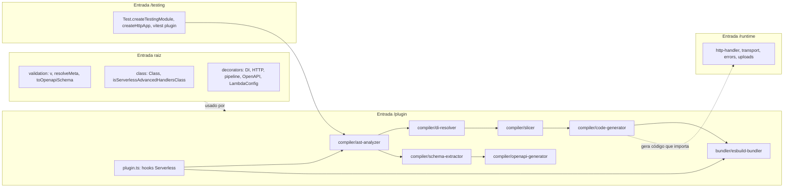

# Architecture (planejada — greenfield)

Detalhes completos em [INSIGHT.md](../../INSIGHT.md). Resumo das camadas:

## Estado atual (F00/F01a/F01b concluídas)

Apenas a camada `Dev` (entrada raiz `.`) e um fragmento mínimo de `Run` (`/runtime`, só `defineReflectMetadata`) existem em código. `Build` (`/plugin`) e o restante de `Run`/`Test` (`/testing`) são placeholders vazios — o diagrama abaixo permanece a visão-alvo, não o estado atual. Ver [STRUCTURE.md](STRUCTURE.md) para o mapeamento real de `src/` e [INTEGRATIONS.md](INTEGRATIONS.md) para o que está de fato conectado hoje.

## Fronteiras
- **Raiz e `/runtime`** nunca importam `ts-morph`, `esbuild` ou `typescript` (REQ-002).
- **Decorators** não têm efeito em runtime nas Lambdas: são lidos pelo compilador e removidos das fatias.
- **Schemas** são executados em build somente dentro do processo filho do Schema Extractor.
