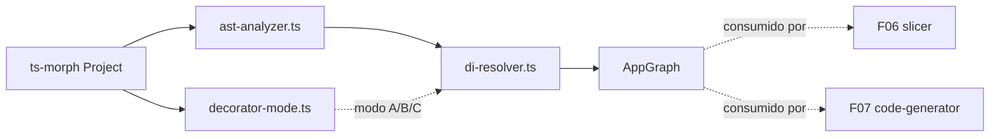

# Design: Motor de Resolução de DI — AOT com `ts-morph` (F05)

## Architecture Overview

Primeiro código de **compilador** do pacote. Vive em `src/compiler/*`, consumido só pela entrada `/plugin` (CJS, F10) — nunca pela raiz nem por `/runtime` (REQ-002, já garantido por `test/boundaries.spec.ts`). Recebe um `ts-morph.Project` já carregado (a descoberta de `tsconfig.json`/entrypoint a partir de `serverless.yml` é do plugin, F10 — fora de escopo aqui) e devolve uma estrutura de dados resolvida (`AppGraph`), sem gerar nenhum código — geração é F06/F07.



## Dependency Paths (from graph)
N/A — sem nó no grafo (`compiler/*` não existe ainda). Caminho planejado (já em `public-api/design.md`): `REQ-004..008, 030..037 → decorators/di.ts (existente) → compiler/decorator-mode.ts → compiler/ast-analyzer.ts → compiler/di-resolver.ts`.

## Validação do risco de ferramenta (protótipo, 2026-09-16)
Confirmado com fixture real (`@Module`/`@Injectable`/`@Inject`, ver CONCERNS.md): resolução de parâmetro de construtor através de barrel até a classe concreta; leitura do array `providers`/`controllers` com cada identificador resolvido ao `ClassDeclaration`; detecção de ciclo via DFS; ordenação topológica; parâmetro de interface sem símbolo de classe (`InterfaceDeclaration`, não `ClassDeclaration`) — gatilho exato pra exigir `@Inject`; `@Inject(TOKEN)` resolvido ao `VariableDeclaration` do token; `SpreadElement` em array de providers detectado. `ts-morph` não depende da `typescript` do projeto (carrega a sua).

## Estruturas de dados

```ts
/** Chave de token normalizada: identidade de referência pro nó ts-morph (classe/const), ou o valor literal pra string. */
type TokenKey = ClassDeclaration | VariableDeclaration | string;

interface ProviderResolution {
  token: TokenKey;
  kind: 'class' | 'useClass' | 'useValue' | 'useFactory' | 'useExisting';
  classDecl?: ClassDeclaration;       // 'class' | 'useClass'
  factoryDecl?: Node;                 // 'useFactory' — a função em si (analisada, não executada)
  existingToken?: TokenKey;           // 'useExisting'
  scope: 'default' | 'request';
  deps: TokenKey[];                   // parâmetros do construtor (classe/useClass) ou de `inject` (useFactory), já resolvidos
  optionalDeps: Set<number>;          // índices de deps marcadas @Optional()
  sourceModule: ModuleNode;
  declarationNode: Node;              // pra mensagem de erro (arquivo + linha)
}

interface ModuleNode {
  classDecl: ClassDeclaration;
  isGlobal: boolean;
  imports: ModuleNode[];
  controllers: ClassDeclaration[];
  providers: ProviderResolution[];    // só os declarados NESTE módulo
  exports: TokenKey[];                // subconjunto de `providers` (ou re-export de token importado)
}

interface AppGraph {
  rootModule: ModuleNode;
  modules: Map<ClassDeclaration, ModuleNode>;     // todos os módulos visitados
  providers: Map<TokenKey, ProviderResolution>;   // registro global efetivo (após @Global())
  controllers: ClassDeclaration[];                // todos, de todos os módulos
  order: TokenKey[];                              // ordem topológica (folhas primeiro) de TODOS os providers
}
```

`TokenKey` usa o próprio nó `ts-morph` (por referência de objeto, válido durante uma única passada de compilação) como chave de `Map` — evita reimplementar resolução de símbolo à mão; strings usam o valor literal.

## Catálogo de erros desta feature (SAH1xx, base compartilhada)

`src/compiler/errors.ts` define a classe base `CompilerError` (`code`, `message`, `filePath`, `line`) que toda feature de compilador (F05, F06, F09...) reusa — formato final: `[serverless-advanced-handlers] SAH<code> <mensagem> at <arquivo>:<linha>`.

| Código   | Disparado quando                                                                          |
| :------- | :----------------------------------------------------------------------------------------- |
| `SAH100` | `imports`/`controllers`/`providers`/`exports` não é um array literal só de elementos analisáveis (tem `SpreadElement`, `ConditionalExpression`, chamada não reconhecida) — REQ-036 |
| `SAH101` | token resolvido (classe/string/symbol) não encontrado no escopo visível do módulo (próprio + `exports` dos imports + `@Global()`) |
| `SAH102` | ciclo de dependência — mensagem lista o ciclo completo (REQ-037) |
| `SAH103` | parâmetro de construtor sem `@Inject` cujo tipo não resolve a uma classe (interface, type alias, primitivo) — REQ-033/036 |
| `SAH104` | provider existe no módulo mas não está em `exports`, e outro módulo tenta usá-lo via import |
| `SAH105` | `X.forRoot(...)` com argumento fora do subconjunto (não é `ObjectLiteralExpression` com valores literais/const importada/`process.env.*`) — REQ-034/036 |

## Algoritmo (`di-resolver.ts`)

1. **Entrada:** `resolveAppGraph(project: Project, rootModule: ClassDeclaration): AppGraph`.
2. **Varredura recursiva de módulos** (BFS/DFS a partir de `rootModule`, com `visited: Set<ClassDeclaration>` pra não reprocessar/loopar em imports cruzados legítimos):
   - Lê o argumento do decorator `@Module(...)` via `ast-analyzer.readModuleMetadata()` — valida que é um `ObjectLiteralExpression` com só as chaves `imports`/`controllers`/`providers`/`exports`, cada uma (se presente) um array literal analisável (`ast-analyzer.readAnalyzableArray()`, que já lança `SAH100` no primeiro elemento não suportado).
   - Cada elemento de `imports`: resolve a um `ClassDeclaration` com `@Module` (import estático) OU a uma `CallExpression` de método estático (`X.forRoot({...})`) — nesse caso, valida os argumentos (`SAH105` se fora do subconjunto) e trata como módulo dinâmico (a classe base `X` ainda fornece `imports`/`providers`/`exports` **estáticos** do próprio decorator `@Module`, se houver; os argumentos do `forRoot` não afetam a resolução de DI nesta fase — só serão copiados pro código gerado em F06/F07).
   - `@Global()` marca o `ModuleNode.isGlobal = true`.
3. **Registro global de providers:** depois da varredura completa, para cada `ModuleNode` com `isGlobal`, seus `exports` entram no mapa global `AppGraph.providers` visível de **qualquer** módulo (REQ-030). Módulos não-globais só expõem `exports` pra quem os importa diretamente.
4. **Resolução de dependências** (para cada `ModuleNode.controllers` + `ModuleNode.providers.classDecl`, nesta ordem, visitando construtor):
   - Para cada parâmetro: se tem decorator `@Inject(token)`, resolve `token` (Identifier → declaração; string literal → valor); senão resolve o **tipo** do parâmetro via símbolo — se o símbolo tiver uma `ClassDeclaration` entre suas declarações, o token é essa classe; senão → `SAH103` (arquivo:linha do parâmetro).
   - `@Optional()` no parâmetro: se o token não for encontrado no passo 5, não é erro — fica marcado em `optionalDeps` (undefined em runtime, decisão de F06/F07).
   - `useFactory`: os tokens vêm do array `inject` (mesma regra: elementos são `Token` ou `{token, optional: true}`).
5. **Lookup de escopo:** pra cada token resolvido no passo 4, procura em (a) providers do próprio módulo, (b) `exports` de cada módulo em `imports` (direto, não transitivo — REQ-030 é explícito que só o que é exportado é visível), (c) o registro global (`@Global()`). Não encontrado → `SAH101`. Encontrado num módulo importado mas não presente em `exports` dele → `SAH104` (mensagem diferencia de `SAH101`: "existe mas não foi exportado").
6. **Grafo + ciclo:** monta o grafo dirigido `provider/controller → suas deps resolvidas` (ignorando `optionalDeps` não encontradas) sobre TODOS os nós de TODOS os módulos. DFS com pilha de visita (mesmo algoritmo do protótipo) — ciclo encontrado → `SAH102`, mensagem = `A -> B -> A` (nomes de classe, na ordem do ciclo).
7. **Ordenação topológica:** sem ciclo, `order` = todos os tokens em ordem de folha-primeiro (mesmo algoritmo do protótipo — pós-ordem de DFS).
8. Devolve `AppGraph` completo. **Nenhum código é gerado aqui** — isso é `code-generator.ts` (F07), que consome `order` pra emitir as instanciações estáticas na ordem certa e `Scope.REQUEST` pra decidir o que vai dentro do `handler` vs. no top-level.

## `ast-analyzer.ts` (utilitários genéricos, reusados por F06/F07/F09)
- `readDecoratorArgument(node, decoratorName): Node | undefined` — acha o decorator pelo nome e devolve seu primeiro argumento.
- `readAnalyzableArray(arrayLiteralOrUndefined): Node[]` — valida que é `ArrayLiteralExpression` só com `Identifier`/`CallExpression`/`ObjectLiteralExpression` (conforme o contexto) e lança `SAH100` no primeiro elemento fora disso (com `node.getSourceFile().getFilePath()` + `node.getStartLineNumber()`).
- `resolveIdentifierToClass(node): ClassDeclaration | undefined` — segue `getSymbol()`/`getAliasedSymbol()` até achar uma declaração `ClassDeclaration` (funciona através de barrels, confirmado no protótipo).
- `resolveTypeToClass(type): ClassDeclaration | undefined` — mesma ideia, mas a partir de um `Type` (usado pra parâmetros de construtor sem `@Inject`).

## `decorator-mode.ts`
`detectDecoratorMode(project: Project): 'A' | 'B' | 'C'` — lê `project.getCompilerOptions()` (já resolvido, incluindo `extends` — confirmado no protótipo que o `ts-morph` resolve isso sozinho a partir do `tsConfigFilePath`): `experimentalDecorators && emitDecoratorMetadata` → B; só `experimentalDecorators` → A; nenhum dos dois → C (REQ-004).

## New Components
| Componente            | Responsabilidade                                                  | Local                          |
| :--------------------- | :------------------------------------------------------------------ | :------------------------------- |
| Erros de compilador     | `CompilerError` base + códigos SAH1xx desta feature                  | `src/compiler/errors.ts`          |
| Detector de modo        | tsconfig efetivo → A/B/C                                             | `src/compiler/decorator-mode.ts`   |
| Analisador AST genérico  | Helpers reusáveis de leitura/validação de decorator e array          | `src/compiler/ast-analyzer.ts`      |
| Resolvedor de DI          | Algoritmo completo (varredura, registro, resolução, ciclo, ordem)   | `src/compiler/di-resolver.ts`        |

## Modified Components
Nenhum (as features anteriores só declaram tipos/decorators no-op; nada aqui os altera).

## Risks
- **Primeiro consumidor real de `ts-morph`** (`devDependency`, build-time only, `deps.neverBundle` no `tsdown.config.ts` já cobre isso por padrão de nome — confirmar que `ts-morph` está na lista `buildTimeOnly` do `tsdown.config.ts`, REQ-002). Mitigado por protótipo (ver acima).
- **Custo de manter um `ts-morph.Project` inteiro em memória** pra projetos grandes — fora de escopo medir agora (não há projeto de usuário real ainda); registrar como nota de performance pra quando houver benchmark real (F10+).
- **`useFactory`/`useValue` não são "fatiáveis"** (INSIGHT §6.3) — a resolução aqui trata a fábrica só como nó AST (não executa), mas o F06 (slicer) vai precisar manter a classe/função inteira quando o provider não for uma classe simples. Não é um problema desta feature, é uma dependência que F06 herda.

## Decision Log
1. **`TokenKey` usa o próprio nó `ts-morph` como chave de `Map`** (identidade de referência), não uma string sintética — evita reimplementar resolução de símbolo e aproveita que o `Project` inteiro fica em memória durante uma passada de compilação.
2. **`exports` não é transitivo** (REQ-030 já implica isso, mas fica explícito aqui): um módulo só vê o que os módulos que ele importa **diretamente** exportam, mais o que é `@Global()`. Um módulo B importado por A, que por sua vez é importado por C, não expõe nada pra C através de A a menos que A reexporte.
3. **Módulo dinâmico (`X.forRoot(...)`)**: os argumentos do `forRoot` não entram na resolução de DI desta feature — só são validados como analisáveis (`SAH105`) e ficam guardados pra F06/F07 copiarem pro código gerado. A DI em si continua vindo do `@Module` estático da classe `X`.
4. **`SAH104` existe separado de `SAH101`** porque a causa raiz é diferente (esqueceu de exportar vs. provider realmente não existe) — mensagens de erro mais úteis valem o código extra.
5. **`CompilerError`/catálogo SAH fica em `src/compiler/errors.ts`**, não espalhado por feature, porque F06/F09/F10 vão precisar do mesmo formato — criar a base aqui evita retrabalho.
