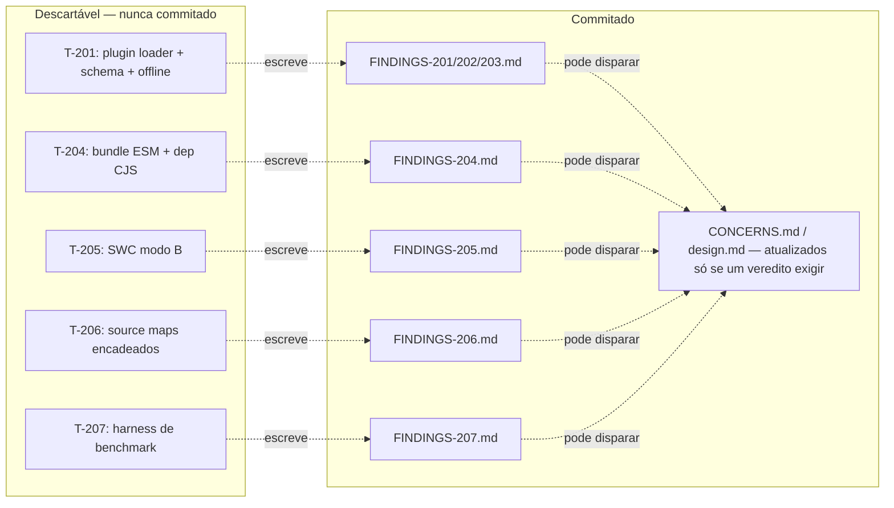

# Design: F02 `poc-risks`

## Architecture Overview

Não há arquitetura de produção aqui — o "sistema" desta feature é um **processo repetível de experimento**, aplicado 5 vezes (uma por task, cobrindo os 7 REQs). Cada experimento:

1. É construído **fora do repositório principal**, num diretório descartável dentro do scratchpad da sessão (`<scratchpad>/poc-risks/<slug>/`) — nunca em `src/`, nunca num worktree git (não há necessidade de rastrear isso no git; evita também o problema de path longo do Windows que já mordeu os worktrees de task anteriores).
2. Instala só as dependências que aquele experimento específico precisa (`serverless@3`, `osls`, `serverless-offline`, `@swc/core`, etc.) — **nunca** como devDependency do pacote (`package.json` da lib fica intocado).
3. Roda, captura evidência (stdout, arquivo gerado, stack trace) e produz um veredito.
4. Escreve `.specs/features/poc-risks/findings/FINDINGS-<REQ>.md` com: Método, Evidência (trechos relevantes, não o log inteiro), Veredito (`PASS` / `PASS-COM-RESSALVA` / `FAIL` / `INCONCLUSIVO`), Impacto (o que isso muda em `CONCERNS.md`/`design.md` de features dependentes, se algo mudar).
5. **Nada do código do experimento é commitado.** Só o `FINDINGS-<REQ>.md` entra no repo, no mesmo commit que qualquer atualização de spec/design/CONCERNS que ele disparar (Spec Gate).

## Dependency Paths (from graph)

N/A — confirmado no spec.md: nenhum nó do grafo (`compiler/*`, `bundler/*`, `plugin.ts`) existe ainda. Esta feature não tem "caminho" no código atual porque valida decisões que **antecedem** o código.

## Tasks (agrupamento por experimento)

| Task | REQs | O que instala/testa | Onda |
| :--- | :--- | :--- | :--- |
| T-201 | REQ-201, REQ-202, REQ-203 | `serverless@3`, `osls@3`, `osls@4` (cada num subdiretório próprio) + fixture `serverless.yml` mínima com `plugins: ['<pkg>/plugin']`, `provider.runtime: nodejs24.x`; depois `serverless-offline` nos três | P1 |
| T-204 | REQ-204 | esbuild (já devDependency da lib — usar a mesma versão) + uma dependência real CJS-only (candidata: `bcryptjs` ou similar sem `exports.import`; DEV escolhe e justifica) | P1 |
| T-205 | REQ-205 | `@swc/core` + `reflect-metadata` sobre uma classe copiada de `src/decorators/di.ts` (fixture isolada, não importa a lib) | P1 |
| T-206 | REQ-206 | `esbuild` + uma transformação de AST simples (`ts-morph` ou `typescript` puro) que move um método pra outro arquivo, gerando source map encadeado | P1 |
| T-207 | REQ-207 | 3 artefatos de handler (bootstrap completo / bundle por controller / bundle por método) + script de medição — **sem deploy** | P2 (depende só de T-201 pra reaproveitar a fixture `serverless.yml`) |

Todas as tasks de P1 são independentes entre si — paralelizáveis em agentes separados, sem worktree (não há `src/` em jogo).

## New Components

Nenhum em `src/`. Os "componentes" são os próprios harnesses de experimento, efêmeros, descritos na tabela acima.

## Modified Components

| Componente | Mudança | Risco |
| :--- | :--- | :--- |
| `CONCERNS.md` | Cada `FINDINGS-<REQ>.md` com veredito `FAIL` ou `PASS-COM-RESSALVA` adiciona/atualiza uma linha na tabela de riscos | Baixo — é só documentação |
| `ROADMAP.md` | Status de F02 avança conforme as tasks fecham; ao final, `F06 method-slicing` e `F10 serverless-plugin` (que dependem de F02) podem ganhar notas de pré-requisito | Baixo |

## Riscos desta própria feature (meta)

- **REQ-207 sem AWS real** é o maior risco de ficar incompleto: a sessão não tem rede liberada pra AWS (SSL cert falha — ver spec.md). O harness fica pronto, mas o número real de cold start só existe depois que o usuário (ou uma sessão com rede liberada) rodar o deploy manualmente. Isso é aceitável — está no Out of Scope do spec — mas **não fechar T-207 como "PASS" sem essa ressalva explícita no FINDINGS-207.md**.
- **REQ-201/202/203 exigem instalar 3 versões de framework** (`serverless@3`, dois `osls`) — pode ser lento/pesado; se `osls` não estiver publicado num registro acessível (é um fork da comunidade), o DEV documenta a tentativa e trata como `INCONCLUSIVO` em vez de travar a task.
- **Nenhuma dessas tasks tem QA/PO no sentido usual** (não há AC de produto pra aceitar, não há código pra verificar) — o "veredito" already é a verificação. O orquestrador revisa o `FINDINGS-<REQ>.md` antes de commitar (equivalente ao papel do PO: julgar se a evidência sustenta o veredito), mas não há agente QA dedicado nesta feature.

## Decision Log

1. Harness de POC nunca é commitado como código — só o veredito escrito. Motivo: manter o pacote publicável limpo e evitar que dependências de framework (Serverless, SWC, etc.) contaminem `package.json`/lockfile da lib.
2. Sem worktree git para os experimentos — usar o scratchpad da sessão. Motivo: nenhuma mudança em `src/` está em jogo, então não há necessidade de isolamento por branch; evita também o bug de path longo do Windows já visto nos worktrees anteriores.
3. Papel PO/DEV/QA não se aplica igual às features de código — o orquestrador revisa o `FINDINGS-<REQ>.md` no lugar do PO, e não há QA (não há o que verificar além do próprio experimento). Motivo: workflow desenhado pra "aceite de entrega de código" não encaixa em "resultado de experimento".
4. T-207 entrega só o artefato pronto pra medir, nunca o deploy real, sem autorização explícita ponto a ponto. Motivo: deploy em conta AWS real tem custo e efeito fora do repositório — está na lista de ações que exigem confirmação explícita.
