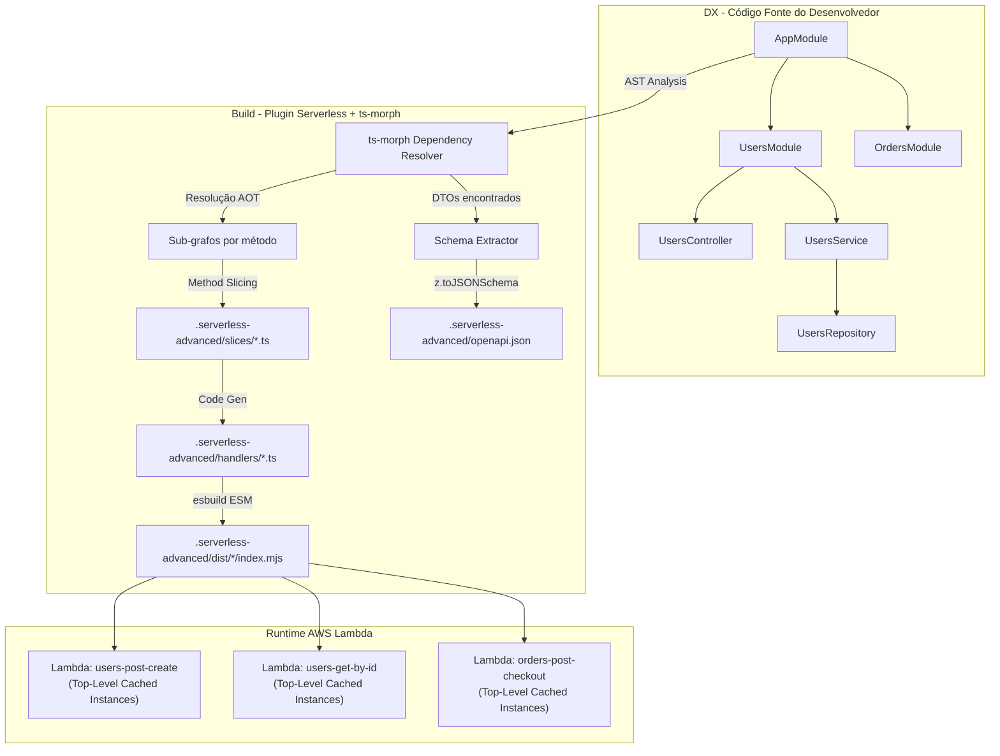
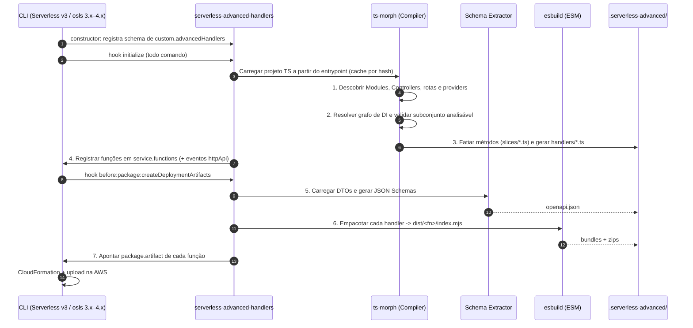

# Serverless Advanced Handlers

> **Visão Geral:** Plugin para **Serverless Framework v3** e **osls 3.x/4.x** (Open Serverless — fork open-source do v3, recomendado por ser mantido e não exigir login nem licença) que une a Developer Experience (DX) do **NestJS** (Modules, Controllers, Injectables, Decorators) à performance de **Lambdas granulares ("handler-per-method")**, resolvendo a Injeção de Dependência e o **fatiamento de métodos** em **tempo de compilação (AOT via `ts-morph`)**, empacotando com **`esbuild` em ESM nativo (Node.js 24)** e utilizando **Zod 4** nativamente para validação.

---

## 1. O Problema & A Motivação

### O Cenário Atual no Ecossistema Serverless / NestJS
Hoje, desenvolvedores enfrentam um dilema arquitetural crítico ao rodar Node.js na AWS Lambda:

1. **Abordagem Tradicional Monolítica (NestJS + `@vendia/serverless-express`):**
   - **Vantagens:** DX incrível, arquitetura limpa, módulos coesos, injeção de dependências madura.
   - **Problemas:**
     - Cold starts lentos (1.5s - 4s+), pois o container de DI inteiro é instanciado em runtime via `reflect-metadata`.
     - Bundle monolítico com muito código desnecessário para cada rota.
     - Dependência pesada de CommonJS (CJS), incompatível ou custoso com o ecossistema moderno ESM.
     - Uma única Lambda para a aplicação inteira (perda de granularidade de IAM, timeout, memória e concorrência).

2. **Abordagem Serverless Vanilla / Pura:**
   - **Vantagens:** Cold start mínimo (< 150ms), bundle minúsculo, `handler-per-handler` real.
   - **Problemas:**
     - Baixa manutenibilidade e repetição excessiva de boilerplate (instanciação manual de serviços, DBs, repositórios em cada arquivo).
     - Ausência de um sistema padrão de módulos e DI.
     - Dificuldade para criar testes unitários/integrados com mocks claros.

> Os números de cold start acima são referências de mercado e serão validados com benchmark próprio na Fase 0 do roadmap.

### A Nossa Proposta: AOT Dependency Injection & Handler-per-Method
O **`serverless-advanced-handlers`** elimina esse dilema trazendo **o melhor dos dois mundos**:

- **Em Tempo de Desenvolvimento (DX):** Você escreve código como no NestJS: `@Module`, `@HttpController`, `@Injectable`, `AppModule`, DTOs com `Class(v.object(...))`.
- **Em Tempo de Build (AOT via `ts-morph`):**
  - Analisa a AST a partir do `AppModule` e resolve o grafo de dependências estaticamente.
  - **Fatia cada método de controller** em um arquivo próprio contendo apenas o método, os membros que ele usa e as dependências que ele realmente consome (transitivamente, inclusive nos services).
  - Gera um wrapper de handler por método.
- **Em Tempo de Execução (Lambda Runtime):**
  - Cada handler é um arquivo ESM enxuto contendo apenas as instâncias necessárias para aquele método.
  - As instâncias são criadas no **top-level scope** (fora da função `handler`), aproveitando o **Execution Context Caching da Lambda** entre execuções warm.
  - **DI sem reflexão em runtime**; instanciação direta (`new Service(new Repo())`). Os decorators do framework são removidos do código fatiado (`reflect-metadata` só entra no modo B, para bibliotecas de terceiros).
  - Bundle gerado por `esbuild` em formato ESM nativo (`.mjs`).

---

## 2. Diagrama de Arquitetura



---

## 3. Pilares Técnicos

| Pilar                  | Tecnologia / Estratégia                           | Benefício                                                                               |
| :--------------------- | :------------------------------------------------ | :-------------------------------------------------------------------------------------- |
| **Arquitetura de DI**  | NestJS-like Modules & Providers                   | Organização limpa, desacoplada e familiar                                               |
| **Resolução de Grafo** | **AOT (Ahead-of-Time) via `ts-morph`**            | Elimina `reflect-metadata` em runtime                                                   |
| **Granularidade**      | **Method Slicing + Handler-per-Method**           | Cada Lambda carrega só o método, seus membros e suas dependências reais                 |
| **Empacotador**        | **API do `esbuild` em ESM (`node24`)**            | Builds sub-segundo, ESM nativo, sem código de métodos/controllers não usados            |
| **Validação**          | **Motor `v` (namespace sobre Zod 4)**             | Zod 4 completo + extensões bidirecionais (`boolish`, `delimited`, `file`, `datetime`...) |
| **Documentação**       | **Schema Extractor em build + `z.toJSONSchema`**  | OpenAPI 3.1 ou 3.0 gerado a partir das classes `Class(...)`                             |
| **Lifecycle Lambda**   | **Top-Level Scope Caching + Top-Level Await**     | Singletons reutilizados em warm starts; inicialização assíncrona no cold start          |

---

## 4. Comparativo: Código Escrito vs. Código Gerado

### 4.1 O que o Desenvolvedor Escreve (NestJS DX + Validação com `v`)

> src/shared/entities/user.entity.ts
```ts
import { v, Class } from 'serverless-advanced-handlers'

// Class() cria uma classe base tipada a partir do schema:
// - expõe schema/object/shape e os helpers pick/omit/partial/extend
// - parse()/safeParse() retornam INSTÂNCIAS da classe (getters e métodos funcionam)
// - é marcada com um Symbol, detectável via isServerlessAdvancedHandlersClass(),
//   permitindo portar automaticamente para OpenAPI e, no futuro, outros protocolos
export class UserEntity extends Class(v.object({
  id: v.uuid().meta({
    description: 'The user ID',
    examples: ['0b0e3c3e-7a3b-4f5e-9d2a-1c2b3d4e5f60'],
  }),
  name: v.string().min(3).meta({
    description: 'The user name',
    examples: ['John Doe'],
  }),
  email: v.email().meta({
    description: 'The user email',
    examples: ['john.doe@email.com'],
  }),
  age: v.number().int().positive().meta({
    description: 'The user age',
    examples: [28],
  }),
  isActive: v.boolish().default(true).meta({
    description: 'Se o usuário está ativo no sistema',
    examples: [true],
  }),
  createdAt: v.datetime().meta({
    description: 'The user creation date',
    examples: ['2024-01-01T12:00:00.000Z'], // exemplos fixos: o openapi.json deve ser determinístico
  }),
  updatedAt: v.datetime().meta({
    description: 'The user update date',
    examples: ['2024-01-01T12:00:00.000Z'],
  }),
})) {
  get displayName() {
    return `${this.name} <${this.email}>`;
  }
}
```

> src/users/users.dto.ts
```ts
import { UserEntity } from '@/shared/entities/user.entity'
import { v, Class } from 'serverless-advanced-handlers'

// DTO para Criação (JSON Body)
export class CreateUserBody extends Class(UserEntity.omit({
  id: true,
  createdAt: true,
  updatedAt: true,
})) {}

// Class() aceita tanto um v.object quanto outra classe criada por Class()
export class CreateUserResponse extends Class(UserEntity) {}

// DTO para Paginação e Filtros (@HttpQuery com boolish, delimited e alias snake_case)
export class ListUsersQuery extends Class(v.object({
  page: v.coerce.number().int().positive().default(1).meta({
    description: 'Página atual para paginação',
    examples: [1],
  }),
  limit: v.coerce.number().int().min(1).max(100).default(20).meta({
    description: 'Quantidade de itens por página',
    examples: [20],
  }),
  search: v.string().optional().meta({
    description: 'Termo para busca textual por nome ou email',
    examples: ['John'],
  }),
  isActive: v.boolish().optional().meta({
    name: 'is_active', // Mapeia ?is_active=1 para isActive no TypeScript
    description: 'Filtro por status ativo (aceita true/false, 1/0, yes/no, on/off)',
    examples: [true],
  }),
  roles: v.delimited(v.string()).default([]).meta({
    description: 'Lista de papéis separados por vírgula (ex: ?roles=admin,editor)',
    examples: ['admin,editor'],
  }),
})) {}

// DTO para Parâmetros de Rota (@HttpParams)
export class UserRouteParams extends Class(v.object({
  id: v.uuid().meta({
    description: 'UUID do usuário na rota',
    examples: ['550e8400-e29b-41d4-a716-446655440000'],
  }),
})) {}

// DTO para Headers HTTP (@HttpHeaders)
export class UserRequestHeaders extends Class(v.object({
  authorization: v.string().startsWith('Bearer ').meta({
    description: 'Token JWT de autenticação Bearer',
    examples: ['Bearer eyJhbGciOi...'],
  }),
  'x-workspace-id': v.uuid().optional().meta({
    description: 'ID do workspace / tenant atual',
    examples: ['a3b8c2d1-0000-4000-8000-000000000001'],
  }),
})) {}

// DTO para Upload de Arquivos / Multipart Form (@HttpForm com v.file)
export class UploadAvatarForm extends Class(v.object({
  description: v.string().optional().meta({
    description: 'Descrição ou legenda do avatar',
    examples: ['Foto de perfil atualizada'],
  }),
  // v.file() = z.file() + atalhos maxSize/mimetypes.
  // Acima do limite inline (~4MB), o framework usa o fluxo S3 automaticamente (ver 7.6).
  avatar: v.file({
    maxSize: '5MB',
    mimetypes: ['image/jpeg', 'image/png', 'image/webp'],
  }).meta({
    description: 'Arquivo de imagem do avatar',
  }),
})) {}
```

> src/users/users.service.ts
```ts
import { Injectable, UploadedFile } from 'serverless-advanced-handlers';
import { DatabaseService } from '@/shared/database/database.service';
import { CreateUserBody, ListUsersQuery } from './users.dto';

@Injectable()
export class UsersService {
  constructor(private readonly databaseService: DatabaseService) {}

  async create(body: CreateUserBody) {
    return this.databaseService.insert('users', body);
  }

  async list(query: ListUsersQuery) {
    return this.databaseService.findMany('users', {
      skip: (query.page - 1) * query.limit,
      take: query.limit,
      search: query.search,
    });
  }

  async findById(id: string) {
    return this.databaseService.findById('users', id);
  }

  async updateAvatar(id: string, file: UploadedFile, description?: string) {
    // UploadedFile estende o File da Web: name, type, size, bytes(), stream(), arrayBuffer()
    // file.location só existe quando o upload veio pelo fluxo S3 (dá para copiar sem baixar)
    return this.databaseService.saveAvatar(id, {
      filename: file.name,
      mimetype: file.type,
      size: file.size,
      content: file.location ?? (await file.bytes()),
      description,
    });
  }
}
```

> src/users/users.controller.ts
```ts
import {
  HttpController,
  HttpGet, HttpPost,
  HttpBody, HttpQuery, HttpParams, HttpHeaders, HttpForm,
  HttpCode, HttpStatus,
  OpenapiTags, OpenapiOperation, OpenapiConsumes, OpenapiProduces,
  OpenapiCreatedResponse, OpenapiOkResponse,
} from 'serverless-advanced-handlers';
import { UsersService } from './users.service';
import {
  CreateUserBody, CreateUserResponse,
  ListUsersQuery, UserRouteParams, UserRequestHeaders,
  UploadAvatarForm,
} from './users.dto';

@OpenapiTags('users')
@HttpController('users')
export class UsersController {
  constructor(private readonly usersService: UsersService) {}

  // 1. POST com @HttpBody (JSON)
  @HttpPost('/')
  @HttpCode(HttpStatus.CREATED)
  @OpenapiOperation({ summary: 'Criar novo usuário' })
  @OpenapiConsumes('application/json')
  @OpenapiProduces('application/json')
  @OpenapiCreatedResponse({
    description: 'Usuário criado com sucesso',
    schema: CreateUserResponse,
  })
  async postCreate(@HttpBody(CreateUserBody) body: CreateUserBody): Promise<CreateUserResponse> {
    return this.usersService.create(body);
  }

  // 2. GET com @HttpQuery (filtros/paginação) e @HttpHeaders (headers customizados)
  @HttpGet('/')
  @OpenapiOperation({ summary: 'Listar usuários com paginação' })
  @OpenapiOkResponse({ description: 'Lista de usuários retornada' })
  async getList(
    @HttpQuery(ListUsersQuery) query: ListUsersQuery,
    @HttpHeaders(UserRequestHeaders) headers: UserRequestHeaders
  ) {
    // query.page e query.limit já vêm como inteiros validados e com valores default aplicados!
    // headers.authorization e headers['x-workspace-id'] já vêm validados!
    return this.usersService.list(query);
  }

  // 3. GET com @HttpParams (parâmetros de rota como /users/:id)
  @HttpGet('/:id')
  @OpenapiOperation({ summary: 'Buscar usuário por ID' })
  @OpenapiOkResponse({ description: 'Usuário encontrado', schema: CreateUserResponse })
  async getById(@HttpParams(UserRouteParams) params: UserRouteParams): Promise<CreateUserResponse> {
    return this.usersService.findById(params.id);
  }

  // 4. POST com @HttpForm (Multipart / Form-Data estilo Multer para Uploads)
  @HttpPost('/:id/avatar')
  @OpenapiOperation({ summary: 'Upload do avatar do usuário' })
  @OpenapiConsumes('multipart/form-data')
  @OpenapiOkResponse({ description: 'Avatar atualizado com sucesso' })
  async uploadAvatar(
    @HttpParams(UserRouteParams) params: UserRouteParams,
    @HttpForm(UploadAvatarForm) form: UploadAvatarForm
  ) {
    // form.avatar é um UploadedFile (File da Web + fieldname/location)
    // form.description é uma string regular do form-data
    return this.usersService.updateAvatar(params.id, form.avatar, form.description);
  }
}
```

> src/users/users.module.ts
```ts
import { Module } from 'serverless-advanced-handlers';
import { UsersController } from './users.controller';
import { UsersService } from './users.service';
import { DatabaseModule } from '@/shared/database/database.module';

@Module({
  imports: [DatabaseModule],
  controllers: [UsersController],
  providers: [UsersService],
})
export class UsersModule {}
```

> src/app.module.ts
```ts
import { Module } from 'serverless-advanced-handlers';
import { UsersModule } from './users/users.module';

@Module({
  imports: [UsersModule],
})
export class AppModule {}
```

---

### 4.2 O que o Plugin Gera Automaticamente via `ts-morph` (AOT)

Para o endpoint `POST /users`, o plugin gera **fatias** (slices) das classes envolvidas e um wrapper de handler.

**Fatia do controller** — só `postCreate`, sem decorators, sem os outros métodos e sem os imports que só eles usavam:

```ts
// .serverless-advanced/slices/users.controller.post-create.ts
// GERADO AUTOMATICAMENTE - NÃO EDITE MANUALMENTE
import type { UsersService } from './users.service.create';
import type { CreateUserBody } from '../../src/users/users.dto';

export class UsersController {
  constructor(private readonly usersService: UsersService) {}

  async postCreate(body: CreateUserBody) {
    return this.usersService.create(body);
  }
}
```

**Handler da Lambda:**

```ts
// .serverless-advanced/handlers/users-post-create.ts
// GERADO AUTOMATICAMENTE - NÃO EDITE MANUALMENTE
import type { APIGatewayProxyEventV2 } from 'aws-lambda';
import {
  parseJsonBody, decodeTransport, encodeTransport, jsonResponse, handleHttpError,
} from 'serverless-advanced-handlers/runtime';
import { DatabaseService } from '../slices/database.service.insert';
import { UsersService } from '../slices/users.service.create';
import { UsersController } from '../slices/users.controller.post-create';
import { CreateUserBody, CreateUserResponse } from '../slices/users.dto.post-create';

// ============================================================================
// INSTANCIAÇÃO TOP-LEVEL (CACHED NO WARM START DA LAMBDA)
// Apenas os providers que postCreate usa, em ordem topológica.
// ============================================================================
const databaseService = new DatabaseService();
await databaseService.onModuleInit(); // lifecycle assíncrono via top-level await (ESM)
const usersService = new UsersService(databaseService);
const usersController = new UsersController(usersService);

// ============================================================================
// HANDLER DA LAMBDA
// ============================================================================
export const handler = async (event: APIGatewayProxyEventV2) => {
  try {
    // 1. Extração, remapeamento de aliases (meta.name) e validação -> instância de CreateUserBody
    const body = CreateUserBody.parse(decodeTransport(CreateUserBody, parseJsonBody(event)));

    // 2. Execução direta do método do Controller
    const result = await usersController.postCreate(body);

    // 3. Serialização via schema (codecs -> formato de transporte, remove chaves desconhecidas)
    return jsonResponse(201, encodeTransport(CreateUserResponse, CreateUserResponse.encode(result)));
  } catch (error) {
    return handleHttpError(error);
  }
};
```

> **Por que isso é tão rápido?**
> 1. **Cold Start:** o Node.js instancia apenas os providers que o método usa (não todas as dependências do controller).
> 2. **Warm Start:** a Lambda reaproveita o processo; nenhuma classe é reinstanciada.
> 3. **Bundling:** o `esbuild` recebe apenas as fatias. Métodos não usados, as dependências exclusivas deles e o código dos decorators **nunca entram no bundle**. O esbuild sozinho não remove métodos de classe; é o fatiamento feito pelo `ts-morph` que garante isso (validado em protótipo).

### 4.3 O que o Plugin Gera para OpenAPI / Swagger (AOT)

A geração acontece **em tempo de build**, sem nenhuma reflexão no runtime da Lambda, combinando duas fontes:

1. **Estrutura (via `ts-morph`):**
   - Rotas, métodos HTTP, status (`@HttpCode`), tags e operações (`@Openapi*`).
   - Quais classes são usadas em `@HttpBody`, `@HttpQuery`, `@HttpParams`, `@HttpHeaders` e `@HttpForm`.
   - O tipo de retorno (`Promise<CreateUserResponse>`), confirmando pela cadeia de herança que a classe deriva de `Class(...)`.
2. **Schemas (via Schema Extractor):**
   - O `ts-morph` não avalia cadeias como `UserEntity.omit({...})`; o schema Zod só existe quando o código roda.
   - Por isso o compilador gera um entry de extração que importa **somente os módulos de DTO/entidade** encontrados, empacota com esbuild e executa em um processo filho.
   - Esse processo chama `toOpenapiSchema(Cls.object)` (wrapper de `z.toJSONSchema` com `io: 'input'`, `target` 3.0/3.1 e `override` das extensões) e registra cada classe em `components.schemas` usando o **nome da classe** como `id`.
3. **Resultado:**
   - **Request Body:** `$ref` para `#/components/schemas/CreateUserBody`.
   - **Parameters:** gerados campo a campo a partir do `shape` (query, path, header), usando `meta.name` como nome de transporte.
   - **Response 201:** se `@OpenapiCreatedResponse({ schema })` for omitido, usa o tipo de retorno inferido.
   - **Operações:** `operationId` default `UsersController.postCreate`.
   - Artefato estático `.serverless-advanced/openapi.json` e rota opcional de Swagger UI para dev/staging.

> [!WARNING]
> Arquivos de DTO/entidade são importados durante o build. Eles **não devem ter efeitos colaterais no topo do módulo** (conexões, leitura obrigatória de env, etc.).

---

## 5. Pipeline de Compilação & Ciclo de Vida do Plugin

### Fases de Execução (Serverless v3 / osls)



### Hooks utilizados

A ordem real do ciclo `package` é: `cleanup` → `initialize` → `setupProviderConfiguration` → **`createDeploymentArtifacts`** → `compileLayers` → **`compileFunctions`** → `compileEvents` → `finalize`. Por isso as funções precisam existir **antes** de `createDeploymentArtifacts`, e comandos como `offline`, `invoke local` e `deploy function` (que não passam pelo ciclo `package`) também precisam enxergá-las.

- **`constructor`:** registra o schema de `custom.advancedHandlers` via `configSchemaHandler`.
- **`initialize`** (roda em todos os comandos):
  - Validação de configuração.
  - Análise via `ts-morph` com **cache por hash** (tsconfig + arquivos-fonte) para não reanalisar em `sls info`, `sls remove`, etc.
  - Geração de slices e handlers.
  - Registro das funções em `serverless.service.functions` (handler, eventos `httpApi`/`http`), com merge de overrides declarados pelo usuário e normalização dos nomes finais.
- **`before:package:createDeploymentArtifacts`:**
  - Geração do `openapi.json`.
  - Bundle ESM de cada função via API do esbuild (`format: 'esm'`, `platform: 'node'`, `target: 'node24'`, saída `.mjs`).
  - Criação de um zip por função e atribuição de `package.artifact` (equivalente a `package.individually: true`).
- **`before:deploy:function:packageFunction`:** bundle apenas da função alvo (`sls deploy function -f`).
- **`before:invoke:local:invoke`:** bundle da função invocada localmente.
- **`before:offline:start:init`:** bundle de todas as funções + watch mode com reanálise incremental (`serverless-offline`).

### Detalhes de empacotamento ESM
- Dependências CommonJS que usam `require()` quebram em bundles ESM (`Dynamic require of "x" is not supported`). O bundler injeta um banner com `createRequire(import.meta.url)` e shims de `__dirname`/`__filename`.
- **Compatibilidade:** o plugin usa apenas a API de plugins comum ao Serverless v3 e ao osls 3.x/4.x. Para o osls 4, em particular:
  - O schema de `custom.advancedHandlers` é registrado via `configSchemaHandler`, porque o osls 4 falha com configuração inválida por padrão.
  - O plugin não usa `provider.request()` nem o AWS SDK v2 (removidos) e declara `type` nas opções de CLI.
- **Modo B:** arquivos com decorators remanescentes passam por SWC antes do esbuild (ver 6.6).

---

## 6. Motor de Resolução de Dependências (AOT com `ts-morph`)

### 6.1 Algoritmo de Resolução Estática de DI

1. **Descoberta do Módulo Raiz:**
   - O plugin localiza a classe anotada com `@Module` especificada em `serverless.yml` (padrão: `src/app.module.ts`).

2. **Varredura Recursiva de Módulos:**
   - Extrai arrays de `imports`, `controllers`, `providers` e `exports`.
   - Constrói o **Global Module Registry** (respeitando `exports` e `@Global()`).

3. **Resolução de Constructor Parameters:**
   - Para cada controller registrado, lê a assinatura do construtor via `ts-morph`:
     ```ts
     constructor(private readonly usersService: UsersService) {}
     ```
   - Identifica o tipo do parâmetro (`UsersService`) ou token explícito via `@Inject('CUSTOM_TOKEN')`.
   - Interfaces e type aliases não existem em runtime: exigem `@Inject(token)`.
   - Busca o provider correspondente dentro do escopo do módulo ou nos módulos importados/exportados.
   - Resolve símbolos através de re-exports/barrels e aliases do `tsconfig.json`.
   - Constrói a árvore de instanciação em ordem topológica (folhas primeiro, depois dependentes).

4. **Tratamento de Ciclos de Dependência:**
   - Se for detectada dependência circular em tempo de build, o plugin emite um erro claro antes de gerar o código:
     ```
     [serverless-advanced-handlers] Circular dependency detected:
     UsersService -> AuthService -> UsersService
     ```

5. **Geração de Código Limpa & Type-Safe:**
   - Gera as declarações de `import` relativas.
   - Escreve as instanciações estáticas na ordem correta.
   - Escreve a função `export const handler = async (event, context) => ...`.

### 6.2 Subconjunto Analisável (contrato do compilador)

A DI é resolvida sem executar código, então os módulos precisam ser **estaticamente analisáveis**. Tudo fora deste contrato gera **erro de build com arquivo e linha**.

| Suportado                                                                          | Não suportado (erro de build)                                  |
| :--------------------------------------------------------------------------------- | :------------------------------------------------------------- |
| Arrays literais de identificadores em `imports`/`controllers`/`providers`/`exports` | Spread (`...commonProviders`), arrays computados, condicionais |
| `{ provide, useClass }`, `{ provide, useValue }`, `{ provide, useExisting }`        | Providers vindos de chamadas de função não analisáveis         |
| `{ provide, useFactory, inject }` (factory síncrona ou `async`)                    | `forwardRef` para contornar ciclos                             |
| Tokens: classe, string, `Symbol` constante, `InjectionToken`                       | Tokens calculados em runtime                                   |
| `@Inject(token)`, `@Optional()`, `@Global()`                                       |                                                                |
| Módulos dinâmicos `X.forRoot({...})` com argumentos literais, constantes importadas ou `process.env.*` (a chamada é copiada para o handler gerado) | `forRoot` com argumentos dependentes de estado de runtime |

**Lifecycle & escopos:**
- **Factories `async` e `onModuleInit()`:** executadas com **top-level await** no handler ESM (dentro do cold start). A fase INIT da Lambda tem limite de 10s; inicializações mais longas são reiniciadas na primeira invocação.
- **`Scope.DEFAULT` (singleton):** instanciado no top-level.
- **`Scope.REQUEST`:** instanciado dentro do `handler`, a cada invocação.
- **`onModuleDestroy()`:** best effort. A Lambda não garante evento de shutdown (só há `SIGTERM` com extensão registrada).

### 6.3 Fatiamento de Métodos (Method Slicing)

Objetivo: cada Lambda contém **somente** o código que o método executa.

**Algoritmo (por método de controller):**
1. Copia o arquivo da classe para `.serverless-advanced/slices/` (o `ts-morph` reescreve os imports relativos).
2. A partir do método alvo, coleta transitivamente todos os `this.<membro>` acessados (métodos, getters, campos, parameter properties).
3. Remove membros não alcançados e parâmetros do construtor não usados.
4. Para cada dependência usada (ex.: `this.usersService.create`), resolve a declaração via type checker e **fatia a classe do provider** do mesmo modo, recursivamente.
5. Aplica o mesmo fatiamento em **nível de módulo** para arquivos de DTO: apenas as classes referenciadas permanecem (chamadas como `Class(v.object(...))` impedem o tree-shaking do esbuild).
6. Remove todos os decorators do framework e converte imports usados só como tipo em `import type` (necessário com `verbatimModuleSyntax`).
7. `organizeImports()` remove imports que ficaram sem uso.
8. Fatias idênticas são deduplicadas por hash dos membros mantidos.

**Regras de fallback** (a classe inteira é mantida e um **warning** é emitido no build):
- `this` usado fora de acesso a propriedade: `fn(this)`, `const self = this`, `{ ...this }`.
- Acesso dinâmico: `this[key]`.
- Construtor com corpo (statements além de parameter properties).
- Providers criados por `useFactory`/`useValue` (o objeto não é uma classe fatiável).
- Herança de classes do usuário não resolvida estaticamente (a cadeia `extends` é percorrida quando possível).

```
[serverless-advanced-handlers] Slicing fallback: UsersController.getList
  "this" escapes at src/users/users.controller.ts:42 -> keeping full class
```

**Source maps:** as fatias são produzidas por remoção de trechos do arquivo original, e o mapa gerado aponta para as linhas originais do código do desenvolvedor.

**Protótipo validado:** um controller com `getById` (usa `UsersService` + helper privado `present`) e `uploadAvatar` (usa `AvatarStorage` + parser pesado). A fatia de `getById` manteve `present`, removeu `uploadAvatar`, `AvatarStorage` e os decorators. O bundle final não continha nenhum código de `AvatarStorage`, do parser ou dos decorators.

### 6.4 Pipeline de Requisição (Guards, Interceptors, Filters) — *proposta a detalhar*

Guards, interceptors e filters são providers resolvidos pela mesma DI AOT e **compostos estaticamente** no handler gerado, na ordem: `filters (try/catch)` → `guards` → `interceptors (antes)` → validação Zod → método → `interceptors (depois)` → encode da resposta. Declaração via `@UseGuards`, `@UseInterceptors`, `@UseFilters` em controller/método ou global no `AppModule`.

### 6.5 Testes sem Container em Runtime

O esbuild (e portanto Vitest) não emite `emitDecoratorMetadata`, então não existe DI em runtime. O pacote `serverless-advanced-handlers/testing` usa o mesmo compilador para gerar factories por módulo com overrides:

```ts
const moduleRef = await Test.createTestingModule({ imports: [UsersModule] })
  .overrideProvider(
    { provide: DatabaseService, useValue: databaseServiceMock }, // useValue | useClass | useFactory: mutuamente excludentes
    { provide: CONFIG, useFactory: () => ({ url: 'memory://' }) },
  )
  .compile();

const usersController = moduleRef.get(UsersController);
```

---

### 6.6 Modos de Decorators (detectados pelo tsconfig)

O compilador lê o tsconfig efetivo (incluindo `extends`) e adapta build, bundle e testes. O TypeScript só aceita `emitDecoratorMetadata` junto com `experimentalDecorators`, então existem três modos:

| Modo                                   | tsconfig                                                         | Comportamento                                                                                                                                                                                                                                                                           |
| :------------------------------------- | :--------------------------------------------------------------- | :-------------------------------------------------------------------------------------------------------------------------------------------------------------------------------------------------------------------------------------------------------------------------------------- |
| **A** legado                           | `experimentalDecorators: true`                                   | Bundle apenas com esbuild.                                                                                                                                                                                                                                                              |
| **B** legado + metadata (**padrão**)   | `experimentalDecorators: true` + `emitDecoratorMetadata: true`   | A DI continua AOT. Arquivos com decorators remanescentes após o fatiamento (ex.: entidades TypeORM) passam por SWC (`decoratorMetadata: true`) antes do esbuild. `import 'reflect-metadata'` é injetado nos handlers quando é dependência do projeto. Vitest com `unplugin-swc`.        |
| **C** TC39                             | sem `experimentalDecorators`                                     | Decorators de classe e método iguais; parâmetros via marcadores de tipo. Warning quando o projeto depende de bibliotecas que exigem decorators legados (TypeORM, class-transformer, class-validator).                                                                                  |

**Decorators duais:** as mesmas funções servem aos três modos. A assinatura cobre `(target, key, descriptor)` e `(value, context)`, e o modo é identificado em runtime pelo argumento `context`. Validado em protótipo com type-check e execução nos modos legado e TC39.

**Marcadores de tipo** (válidos em todos os modos, obrigatórios no C):

```ts
@HttpController('users')
export class UsersController {
  constructor(
    private readonly usersService: UsersService,
    private readonly config: Inject<typeof APP_CONFIG, AppConfig>, // equivale a @Inject(APP_CONFIG)
  ) {}

  @HttpPost('/')
  async postCreate(body: HttpBody<CreateUserBody>, req: HttpRequest): Promise<CreateUserResponse> {
    return this.usersService.create(body);
  }
}
```

> **Por que SWC no modo B:** em protótipo, com `emitDecoratorMetadata: true`, o esbuild não emitiu nenhum `design:paramtypes`, enquanto o `tsc` emitiu. Sem o SWC, bibliotecas como TypeORM quebram no bundle. O metadata também não substitui a DI AOT: para parâmetros com token, o `tsc` emite apenas `Object`.

---

## 7. O Motor de Validação `v` & O Padrão `Class(schema)`

### 7.1 O Motor `v` (Validation Primitives sobre Zod 4)

> [!NOTE]
> **Referência & Origem Técnica:** O motor `v` é baseado na biblioteca interna [`@pkgs/lib-validation`](file:///C:/dev/github.com/leandroluk/metha/pkgs/lib-validation) do monorepo Metha, com duas evoluções:
> 1. **Sem Proxy:** `v` é um namespace ESM que reexporta o Zod e adiciona as extensões. `v.string()`, `v.infer<>`, `v.input<>` e as extensões funcionam com tipos reais, sem cast.
> 2. **Extensões bidirecionais:** `preprocess` quebra `z.encode()` (`Encountered unidirectional transform during encode`). Todas as extensões usam `z.codec` ou primitivas nativas, permitindo serializar respostas pelo mesmo schema.

O ecossistema Serverless impõe particularidades que o Zod padrão não atende de forma elegante:
- **Query strings e headers são sempre strings:** booleanos chegam como `"true"`/`"1"`; listas chegam separadas por vírgula (`"admin,editor"`). No payload v2 do API Gateway, chaves repetidas (`?roles=a&roles=b`) já chegam unidas por vírgula.
- **Uploads:** o arquivo precisa de validação de tamanho/mimetype com representação correta no OpenAPI.
- **Durações e datas:** strings legíveis (`"5m"`, `"1d"`) e datas ISO com offset.

> [!WARNING]
> **Armadilhas do Zod 4 que o `v` resolve ou documenta:**
> - `z.coerce.boolean()` usa `Boolean(input)`, então `"false"` vira `true`. Use `v.boolish()`.
> - `z.string().uuid()` / `.email()` estão depreciados: use `v.uuid()` / `v.email()`. `z.uuid()` segue a RFC 9562 (variante `8|9|a|b`); para UUIDs "fora do padrão" use `v.guid()`.
> - `z.iso.datetime()` rejeita offsets (`-03:00`) por padrão; `v.datetime()` usa `{ offset: true }`.
> - Mensagens de erro usam o parâmetro `error` (não `message`). Formatação: `z.flattenError`, `z.treeifyError`, `z.prettifyError`.

```ts
// src/validation/v.ts
import * as z from 'zod';
import type { $input } from 'zod';
import ms, { type StringValue } from 'ms';

export * from 'zod'; // v.* expõe todo o Zod; exports locais abaixo têm precedência (ex.: v.file)
export { instance } from '../class/class-factory'; // v.instance(Cls)

// ---- Metadados tipados (ver 7.3) ----
declare module 'zod' {
  interface GlobalMeta {
    /** Nome do campo no transporte (query, header, form, body). Ex.: 'is_active' */
    name?: string;
    /** Exemplos no formato de transporte, tipados pelo input do schema */
    examples?: $input[];
  }
}

// ---- Representação JSON Schema das extensões (registry interno) ----
const jsonSchemaOverrides = new WeakMap<object, Record<string, unknown>>();
function withJsonSchema<S extends z.ZodType>(schema: S, json: Record<string, unknown>): S {
  jsonSchemaOverrides.set(schema, json);
  return schema;
}

// ---- Tamanhos legíveis ----
export type ByteSize = number | `${number}${'B' | 'KB' | 'MB' | 'GB'}`;
const UNITS = { B: 1, KB: 1024, MB: 1024 ** 2, GB: 1024 ** 3 } as const;
export function parseBytes(size: ByteSize): number {
  if (typeof size === 'number') return size;
  const match = /^(\d+(?:\.\d+)?)(B|KB|MB|GB)$/.exec(size);
  if (!match) throw new Error(`Invalid size: ${size}`);
  return Math.floor(Number(match[1]) * UNITS[match[2] as keyof typeof UNITS]);
}

// ---- Extensões ----

/** boolean nativo OU string (true/false, 1/0, yes/no, on/off). Valores fora da lista falham. */
export function boolish(opts: { truthy?: string[]; falsy?: string[] } = {}) {
  return withJsonSchema(
    z.union([z.boolean(), z.stringbool({ truthy: opts.truthy, falsy: opts.falsy, case: 'insensitive' })]),
    { type: 'boolean' },
  );
}

/** "a, b,,c" ou ["a,b", "c"] -> ["a", "b", "c"]; encode faz join. */
export function delimited<T extends z.ZodType>(element: T, opts: { separator?: string } = {}) {
  const { separator = ',' } = opts;
  return z.codec(z.union([z.string(), z.array(z.string())]), z.array(element), {
    decode: val =>
      (typeof val === 'string' ? val.split(separator) : val.flatMap(item => item.split(separator)))
        .map(item => item.trim())
        .filter(item => item.length > 0) as z.input<T>[],
    encode: items => items.map(String).join(separator),
  });
}

/** "5m" | "1d" | 300000 -> milissegundos. */
export function duration() {
  return withJsonSchema(
    z.codec(z.union([z.string(), z.number()]), z.number().int().nonnegative(), {
      decode: (val, ctx) => {
        if (typeof val === 'number') return val;
        const parsed = ms(val as StringValue);
        if (parsed === undefined) {
          ctx.issues.push({ code: 'custom', message: `Invalid duration: ${val}`, input: val });
          return z.NEVER;
        }
        return parsed;
      },
      encode: millis => millis,
    }),
    { oneOf: [{ type: 'string', examples: ['5m', '1d'] }, { type: 'integer', minimum: 0 }] },
  );
}

/** ISO 8601 (com offset) ou Date -> Date; encode -> ISO string. */
export function datetime() {
  return withJsonSchema(
    z.codec(z.union([z.iso.datetime({ offset: true }), z.date()]), z.date(), {
      decode: val => (val instanceof Date ? val : new Date(val)),
      encode: date => date.toISOString(),
    }),
    { type: 'string', format: 'date-time' },
  );
}

export function timestamp() {
  return datetime().default(() => new Date());
}

/** z.file() + atalhos. Sem argumentos é idêntico a z.file(); .min/.max/.mime continuam encadeáveis. */
export function file(opts: { maxSize?: ByteSize; minSize?: ByteSize; mimetypes?: string[] } = {}) {
  let schema = z.file();
  if (opts.minSize !== undefined) schema = schema.min(parseBytes(opts.minSize));
  if (opts.maxSize !== undefined) schema = schema.max(parseBytes(opts.maxSize));
  if (opts.mimetypes) schema = schema.mime(opts.mimetypes);
  return schema;
}

// ---- JSON Schema / OpenAPI ----
export function toOpenapiSchema(schema: z.ZodType, target: 'openapi-3.0' | 'draft-2020-12' = 'draft-2020-12') {
  return z.toJSONSchema(schema, {
    io: 'input', // formato de transporte (request e response serializado)
    target,      // 'draft-2020-12' para OpenAPI 3.1, 'openapi-3.0' para 3.0
    unrepresentable: 'any',
    override: ctx => {
      const override = jsonSchemaOverrides.get(ctx.zodSchema);
      if (override) {
        for (const key of Object.keys(ctx.jsonSchema)) delete (ctx.jsonSchema as Record<string, unknown>)[key];
        Object.assign(ctx.jsonSchema, override);
      }
      // chaves do framework (name) são removidas; propriedades com alias são renomeadas no objeto pai
    },
  });
}
```

```ts
// src/index.ts
export * as v from './validation/v';
export * from './class/class-factory';
export * from './decorators';
```

**Validado com Zod 4.4.3 + TypeScript:**
- `v.infer<>` funciona.
- `v.file` sobrepõe `z.file` sem conflito de tipos.
- `examples` é tipado pelo input do schema.
- `v.boolish()` rejeita `"banana"` e faz encode.
- `v.datetime()` aceita offset e gera `format: date-time`.
- `v.file()` gera `format: binary`.

---

### 7.2 Como Funciona o `Class(schema)` por Baixo dos Panos

No TypeScript, tipos criados com `type User = v.infer<typeof Schema>` desaparecem após a compilação (type erasure). Já as classes JavaScript existem em runtime como funções construtoras.

A função `Class(schema)` é uma **factory de classe tipada** que resolve esse problema sem duplicar código entre interfaces e schemas, e **`parse()` retorna instâncias reais da classe**:

```ts
// src/class/class-factory.ts
import * as z from 'zod';

const CLASS_MARK: unique symbol = Symbol.for('serverless-advanced-handlers.class');

type AnyObject = z.ZodObject<z.ZodRawShape>;
type AnyConstructor = abstract new (...args: any[]) => any;

export interface AdvancedClass<S extends AnyObject = AnyObject> {
  new (data: z.output<S>): z.output<S>;
  readonly [CLASS_MARK]: true;
  /** ZodObject puro: base para composição (omit/pick/extend) e OpenAPI */
  readonly object: S;
  readonly shape: S['shape'];
  /** Codec object -> instância (tipado como campos). Para aninhar com tipo de instância use v.instance(UserEntity) */
  readonly schema: z.ZodCodec<S, z.ZodType<z.output<S>>>;
  omit: S['omit'];
  pick: S['pick'];
  partial: S['partial'];
  extend: S['extend'];
  /** Valida e retorna instância da subclasse que chamou (CreateUserBody.parse -> CreateUserBody) */
  parse<T extends AnyConstructor>(this: T, input: unknown): InstanceType<T>;
  safeParse<T extends AnyConstructor>(this: T, input: unknown): z.ZodSafeParseResult<InstanceType<T>>;
  /** Serializa instância OU objeto plano para o formato de transporte (remove chaves desconhecidas) */
  encode(value: z.output<S> | z.input<S>): z.input<S>; // input<S> aceita linhas cruas do banco com classes aninhadas
}

/** true para classes criadas por Class() (e suas subclasses); false para v.object e classes comuns */
export function isServerlessAdvancedHandlersClass(value: unknown): value is AdvancedClass {
  return typeof value === 'function' && (value as any)[CLASS_MARK] === true;
}

/** Campo que referencia outra classe Class(), tipado como instância. Reexportado como v.instance */
export function instance<T extends AdvancedClass<any>>(cls: T) {
  return cls.schema as unknown as z.ZodCodec<T['object'], z.ZodType<InstanceType<T>>>;
}

function rebuild(object: AnyObject, shape: z.ZodRawShape): AnyObject {
  const catchall = (object._zod.def as { catchall?: z.ZodType }).catchall;
  const next = z.object(shape);
  return catchall ? next.catchall(catchall) : next;
}

export function Class<S extends AnyObject>(source: S | AdvancedClass<S>): AdvancedClass<S> {
  const object = (isServerlessAdvancedHandlersClass(source) ? source.object : source) as S;
  const codecs = new WeakMap<object, z.ZodType>(); // um codec por subclasse

  class Base {
    static readonly [CLASS_MARK] = true;
    static readonly object = object;
    static readonly shape = object.shape;

    static get schema() {
      let codec = codecs.get(this);
      if (!codec) {
        const Target = this as unknown as new (data: unknown) => object;
        codec = z.codec(object, z.custom<object>(value => typeof value === 'object' && value !== null), {
          decode: data => new Target(data),
          encode: value => ({ ...value }) as z.output<S>, // aceita instância ou objeto plano
        });
        codecs.set(this, codec);
      }
      return codec;
    }

    // omit/pick/partial reconstroem a partir do shape: o Zod nativo lança erro em objetos com refinements.
    // Refinements NÃO são herdados e devem ser reaplicados no schema composto.
    static omit(mask: Record<string, true>) {
      return rebuild(object, Object.fromEntries(Object.entries(object.shape).filter(([key]) => !mask[key])));
    }
    static pick(mask: Record<string, true>) {
      return rebuild(object, Object.fromEntries(Object.entries(object.shape).filter(([key]) => mask[key])));
    }
    static partial() {
      return rebuild(object, Object.fromEntries(Object.entries(object.shape).map(([key, s]) => [key, (s as z.ZodType).optional()])));
    }
    static extend(shape: z.ZodRawShape) {
      return object.extend(shape);
    }

    static parse(input: unknown) {
      return this.schema.parse(input);
    }
    static safeParse(input: unknown) {
      return this.schema.safeParse(input);
    }
    static encode(value: unknown) {
      return z.encode(object, value as z.output<S>);
    }

    /** Não valida: recebe dados já tipados. Para validar, use Cls.parse(). */
    constructor(data?: object) {
      if (data) Object.assign(this, data);
    }
  }

  return Base as unknown as AdvancedClass<S>;
}
```

### 7.3 Comportamentos, Benefícios & Alertas de `Class(zodSchema)`

**Benefícios:**
1. **Zero Duplicação:** uma única definição serve como validador Zod em runtime, tipo TypeScript em compilação e referência de classe em decorators.
2. **Instâncias reais:** `UserEntity.parse(data)` e `UserEntity.schema.parse(data)` retornam `UserEntity`; getters e métodos declarados na classe funcionam. Classes aninhadas via `v.instance(Other)` também viram instâncias, com tipo estático da classe.
3. **Composição Fluente:** `class CreateUserBody extends Class(UserEntity.omit({ ... }))` e `class CreateUserResponse extends Class(UserEntity)`.
4. **Serialização segura:** `Cls.encode(result)` aplica codecs (Date → ISO) e remove chaves desconhecidas (ex.: `passwordHash` retornado pelo banco).
5. **Detecção:** `isServerlessAdvancedHandlersClass(value)` diferencia classes `Class()` de `v.object` e de classes comuns, em runtime e no compilador.
6. **Descoberta AOT:** o `ts-morph` identifica classes que derivam de `Class(...)` pela cadeia de herança, sem anotações redundantes.

**Validado com Zod 4.4.3 + TypeScript:**
- Instâncias retornadas por `parse` e `schema.parse`, inclusive aninhadas.
- `CreateUserBody` não tem o getter de `UserEntity`; `id` omitido gera erro de tipo.
- `encode` remove chaves extras.
- `omit`/`partial` funcionam em objetos com refinements.
- O guard distingue os quatro casos.

> [!WARNING]
> **Alertas para documentar:**
> - **Campos declarados na subclasse com `target: ES2022+`:** `name!: string` é inicializado com `undefined` **depois** do construtor base, apagando o valor. Use `declare name: string`.
> - **Refinements:** `omit`/`pick`/`partial` não carregam `.refine()`/`.superRefine()` do schema original; reaplique no schema composto.
> - **Tipagem estática de `Cls.schema`:** tipa como os campos do schema (não como a subclasse). Para obter o tipo da subclasse use `Cls.parse()`; para aninhar classes com tipo de instância use `v.instance(Other)`.
> - **Construtor não valida:** `new Cls(data)` confia no tipo; validação acontece em `Cls.parse()`.

---

### 7.4 Metadados Tipados (`.meta()`) & Mapeamento de Campos (`snake_case` ⇄ `camelCase`)

O `.meta()` é tipado por **module augmentation** do `GlobalMeta` do Zod (feito em `v.ts`):

```ts
declare module 'zod' {
  interface GlobalMeta {
    name?: string;       // nome no transporte
    examples?: $input[]; // tipado pelo input do schema: v.number().meta({ examples: ['x'] }) é erro
    // já existentes no Zod: id, title, description, deprecated
  }
}
```

**Níveis de rigidez:**
- **No editor:** chaves conhecidas têm tipo e autocomplete (`name: 1` e `examples` com tipo errado são erros).
  - Não é possível proibir chaves desconhecidas só com tipos: o Zod declara `[k: string]: unknown` em `JSONSchemaMeta`, e augmentation só **adiciona** membros, nunca remove.
- **No build:** o Schema Extractor valida todo metadado contra um schema `strict()`. Chaves desconhecidas quebram o build com o caminho do campo:
  ```
  [serverless-advanced-handlers] Unknown meta key "nmae" at UserEntity.shape.name
  ```

**Chaves reservadas:**
- **`name`:** nome do campo no transporte. Mesmo conceito do `name` de parâmetros OpenAPI e do `@Column({ name })` do TypeORM.
- **`id`:** reservado. O Zod usa `id` para extrair o schema para `$defs`/`$ref`, e o framework preenche automaticamente com o **nome da classe** para gerar `components.schemas`. Não use `id` em campos.

**Merge de metadados em wrappers:** `.optional()`, `.nullable()`, `.default()`, `.prefault()`, `.catch()` e `.readonly()` criam novos schemas, e o `meta` do schema interno não aparece no wrapper. O framework resolve com `resolveMeta(schema)`, que percorre a cadeia de dentro para fora e faz `Object.assign` (o mais externo vence):

```ts
v.string().meta({ description: 'Primeiro nome', name: 'fname' }).optional().meta({ name: 'first_name' })
// resolveMeta -> { description: 'Primeiro nome', name: 'first_name' }
```

> Metadados também são herdados nativamente por clones de refinement (`.min()`, `.max()`) e sobrevivem a `omit`/`pick`.

**Exemplos determinísticos:** evite `examples: [new Date().toISOString()]`, pois gera `openapi.json` diferente a cada build.

#### O Problema das Convenções de Nomenclatura: `snake_case` vs `camelCase`
Em APIs reais, há um conflito comum:
- **Convenção HTTP / URL / Query Params:** Frequentemente usa-se `snake_case` (ex: `?first_name=John&is_active=1`) ou `kebab-case`.
- **Convenção TypeScript / JavaScript:** O padrão universal é `camelCase` (ex: `firstName`, `isActive`).

Com o campo **`name`** tipado dentro de `.meta()`, resolvemos esse conflito sem código intermediário:

```ts
export class SearchUserQuery extends Class(v.object({
  firstName: v.string().meta({
    name: 'first_name', // O transporte envia como first_name
    description: 'Primeiro nome do usuário',
    examples: ['John'],
  }),
  isActive: v.boolish().optional().meta({
    name: 'is_active', // O transporte envia como is_active
    description: 'Filtrar apenas usuários ativos',
    examples: [true],
  }),
})) {}
```

#### Como isso é executado em cada camada:

1. **No Runtime da AWS Lambda (Invocação):**
   - A requisição chega com a query string `?first_name=John&is_active=1`.
   - `decodeTransport(Cls, raw)` usa um mapa de aliases calculado **uma vez por classe** (cache no cold start) e remapeia `first_name` → `firstName`, recursivamente em objetos e arrays aninhados.
   - Quando um campo tem `name`, **somente** o nome de transporte é aceito (a chave `firstName` na URL é ignorada).
   - Aplica-se a query, params, headers, form e body JSON na entrada. Na saída, `encodeTransport` faz o caminho inverso na resposta.
   - O Controller recebe o objeto limpo, idiomático e com tipagem estática do TypeScript:
     ```ts
     @HttpGet('/search')
     async search(@HttpQuery(SearchUserQuery) query: SearchUserQuery) {
       console.log(query.firstName); // 'John'
       console.log(query.isActive);  // true
     }
     ```

2. **Na Geração OpenAPI (Tempo de Build):**
   - Parâmetros usam o nome real de transporte (`first_name`); em schemas de body/response, as propriedades são renomeadas no JSON Schema:
     ```json
     {
       "name": "first_name",
       "in": "query",
       "description": "Primeiro nome do usuário",
       "required": true,
       "schema": { "type": "string" },
       "example": "John"
     }
     ```
   - O consumidor da API vê a documentação exatamente como a URL deve ser chamada (`?first_name=`), enquanto a base de código permanece em `camelCase`.

---

### 7.5 Filosofia Multi-Protocolo & Eliminação de Conflitos de Nome — *visão de futuro*

> [!NOTE]
> Esta seção expressa a direção de longo prazo. O escopo inicial é **somente HTTP**.

Um dos maiores problemas em frameworks como NestJS ao misturar REST, Microservices (RabbitMQ/Kafka) e GraphQL na mesma aplicação é a **colisão de nomes de decorators**:
- O que é `@Query()`? É um parâmetro de query string HTTP (`?page=1`) ou uma operação de consulta GraphQL (`query { getUser }`)?
- O que é `@Body()`? É o payload JSON de uma requisição HTTP ou a mensagem de uma fila AMQP / SQS?
- O que é `@Resolver()` vs `@Controller()`?

O **`serverless-advanced-handlers`** adota **protocolos explícitos por design**:

| Protocolo           | Controller / Agrupador          | Decorator de Ação                                  | Decorators de Dados / Parâmetros                                                   |
| :------------------ | :------------------------------ | :------------------------------------------------- | :--------------------------------------------------------------------------------- |
| **HTTP (REST)**     | `@HttpController(prefix)`       | `@HttpGet`, `@HttpPost`, `@HttpPut`, `@HttpDelete` | `@HttpBody`, `@HttpQuery`, `@HttpParams`, `@HttpHeaders`, `@HttpForm`, `@HttpCode` |
| **AWS SQS**         | `@SqsController(queueArn)`      | `@SqsHandler()`                                    | `@SqsMessage(Class)`, `@SqsAttributes`                                             |
| **AWS EventBridge** | `@EventBridgeController()`      | `@EventBridgeRule(source, detailType)`             | `@EventBridgeDetail(Class)`                                                        |
| **AMQP / RabbitMQ** | `@AmqpController()`             | `@AmqpQueue(queueName)`                            | `@AmqpPayload(Class)`, `@AmqpHeaders`                                              |
| **GraphQL**         | `@GraphqlResolver(Type)`        | `@GraphqlQuery(name)`, `@GraphqlMutation(name)`    | `@GraphqlArgs(Class)`, `@GraphqlContext`, `@GraphqlInfo`                           |

**Notas de viabilidade para quando esses protocolos entrarem:**
- **SQS:** o evento do Serverless recebe **ARN**; o handler deve suportar `batchItemFailures` (partial batch response).
- **AMQP:** a Lambda consome de **filas** do Amazon MQ for RabbitMQ; exchanges, bindings e topic patterns são infraestrutura externa.
- **GraphQL:** handler-per-resolver só faz sentido com **AppSync** (resolvers Lambda diretos); no API Gateway seria um único endpoint.
- **gRPC:** não roda em Lambda/API Gateway; o viável é gerar contratos (`.proto`) a partir das classes.

#### Vantagens dessa abordagem:
1. **Zero Colisão de Imports:** Você pode importar e utilizar `@HttpQuery` e `@GraphqlQuery` no mesmo arquivo ou módulo sem precisar renomear com `import { Query as GraphqlQuery }`.
2. **Reaproveitamento de Entidades e Serviços:** A mesma `UserEntity` baseada em `Class(v.object(...))` e o mesmo `UsersService` injetável podem ser consumidos por qualquer tipo de controller.
3. **Mapeamento Preciso de Lambdas:** O plugin sabe exatamente como configurar o gatilho da Lambda em tempo de build (`@Http*` → `httpApi`/`http`, `@Sqs*` → `sqs`, `@EventBridge*` → `eventBridge`, `@Amqp*` → `rabbitmq`).

---

### 7.6 Decorators HTTP & Suporte Avançado a Parâmetros

O plugin disponibiliza decorators tipados para cobrir os cenários de uma API REST na AWS Lambda.

> **Regra geral:** todos os decorators de transporte recebem uma classe derivada de `Class(...)`. O argumento pode ser **omitido** (`@HttpBody() body: CreateUserBody`): o compilador usa o tipo anotado. Se ambos existirem e forem diferentes, o build falha. Nos modos A e B os parâmetros usam decorators; no modo C (TC39, que não tem decorators de parâmetro) usam marcadores de tipo equivalentes, como `body: HttpBody<CreateUserBody>` (ver 6.6).

#### 1. `@HttpQuery(Class)`
- Extrai parâmetros de query string:
  - **`httpApi` (payload v2):** `event.queryStringParameters`; chaves repetidas chegam unidas por vírgula.
  - **`http` (REST, payload v1):** `event.multiValueQueryStringParameters`.
- Coerção via `v.coerce.number()`, `v.boolish()` e `v.delimited()`, com valores default. **Não use `v.coerce.boolean()`**.
- Validação automática de filtros, paginações e ordenações.

#### 2. `@HttpParams(Class)` — Obrigatoriedade de Objetos (Sem decorators soltos)
- Extrai parâmetros de rota da URL (`event.pathParameters`), como `/users/:id` ou `/tenants/:tenantId/projects/:projectId` (convertidos para `/users/{id}` no API Gateway).
- **Decisão Arquitetural: Sem `@HttpParam('id')` isolado.** O framework obriga intencionalmente a existência de classes DTO (`@HttpParams(UserRouteParams)`).
- **Por que exigir classes mesmo para um único parâmetro?**
  1. **Documentação OpenAPI de Primeira Classe:** Cada parâmetro de rota fica formalmente documentado via `.meta({ description, examples })`, sem anotações redundantes nos métodos.
  2. **Eliminação de Magic Strings:** Evita erros de digitação como `@HttpParam('uuid')` quando a rota é `/:id`. O schema define a chave exata esperada, e o compilador valida que todo `:param` da rota existe na classe.
  3. **Extração AST Segura via `ts-morph`:** Em tempo de compilação, o motor estático lê diretamente a referência do tipo da classe, garantindo 100% de precisão sem inspecionar strings em decorators.
  4. **Padronização Universal (DX):** Todos os decorators de transporte (`@HttpBody`, `@HttpQuery`, `@HttpParams`, `@HttpHeaders`, `@HttpForm`) seguem a mesma regra: recebem uma classe tipada derivada de `Class(...)`.

#### 3. `@HttpHeaders(Class)`
- Extrai e normaliza cabeçalhos HTTP da requisição (`event.headers`).
- **Normalização Case-Insensitive:**
  - O payload v2 já entrega os headers em lowercase.
  - No payload v1, o runtime normaliza antes da validação.
  - Cookies do v2 chegam em `event.cookies`.
- Ideal para autenticação (Tokens JWT Bearer), headers de tenant (`x-workspace-id`) e chaves de API (`x-api-key`).

#### 4. `@HttpForm(Class)` — Multipart / Form-Data (Estilo Multer para Serverless)
No Express ou NestJS tradicional, o upload de arquivos usa o `multer` via streams de rede. Na AWS Lambda com API Gateway, o corpo chega inteiro no evento, em base64 (`event.isBase64Encoded: true`).

O **`@HttpForm`** resolve isso de forma nativa e transparente:
- **Parser sem dependências:**
  - O runtime decodifica o base64 e usa o parser nativo do Node (`new Response(body, { headers }).formData()`, via undici).
  - O parser entrega campos de texto e objetos `File` da Web, validados diretamente por `v.file()`.
  - Validado em protótipo.
- **REST API (`http`):** exige `binaryMediaTypes: ['multipart/form-data']`, que o plugin injeta automaticamente. No `httpApi` o base64 é automático.
- **Estrutura de Arquivo (`UploadedFile`):**
  ```ts
  export interface UploadedFile extends File {
    // herdados do File da Web: name, type, size, lastModified, arrayBuffer(), bytes(), stream(), text()
    /** nome do campo no form */
    fieldname: string;
    /** presente quando o arquivo veio pelo fluxo S3 (ver 7.7) */
    location?: { bucket: string; key: string };
  }
  ```
- **Validador `v.file(options)`:**
  ```ts
  avatar: v.file({
    maxSize: '5MB',
    mimetypes: ['image/jpeg', 'image/png', 'image/webp'],
  })
  ```
- Se o arquivo exceder o tamanho máximo ou tiver um mimetype inválido, o validador rejeita automaticamente com HTTP 400 antes mesmo de invocar o Controller.
- **Segurança:** o mimetype é declarado pelo cliente. A opção `verifyMagicBytes` (a definir) confere a assinatura real do arquivo.

---

### 7.7 Uploads Sem Limite Prático de Tamanho (Fluxo S3 Transparente)

**Limites da AWS que não podem ser alterados:**

| Caminho                          | Limite de payload         |
| :------------------------------- | :------------------------ |
| Invocação síncrona da Lambda     | **6 MB** (request e response) |
| API Gateway (HTTP e REST)        | 10 MB                     |
| ALB → Lambda                     | 1 MB                      |
| Base64 no evento                 | +33% de overhead          |

Na prática, **um corpo multipart acima de ~4,4 MB nunca chega à Lambda** (soma de todos os campos, não por arquivo). O framework remove essa limitação da DX tirando o binário do caminho da Lambda, **sem mudar o código do controller**:

**Seleção automática por campo:**
- Se a soma dos `maxSize` dos campos `v.file()` ≤ `uploads.inlineLimit` (default `4MB`), usa o modo **inline**: multipart direto na Lambda (7.6).
- Caso contrário, usa o modo **S3**. A rota também aceita arquivos inline pequenos.

**Modo S3:**
1. **Endpoint companheiro gerado:** para `POST /users/{id}/avatar` o plugin gera `POST /users/{id}/avatar/uploads`, com os **mesmos guards/autorizadores** da rota original.
   - Ele retorna, por campo de arquivo, um **presigned POST** do S3 com as condições de policy derivadas do schema: `content-length-range` = `[minSize, maxSize]` e `Content-Type` ∈ `mimetypes`.
   - **O próprio S3 rejeita arquivos fora do limite**, sem executar Lambda.
   - Também retorna um `uploadToken` assinado (HMAC com bucket, key, campo, rota, principal e expiração).
2. **Cliente envia o arquivo direto ao S3**, sob o prefixo temporário.
   - Presigned POST aceita até 5 GB; acima disso, presigned multipart upload (até 5 TB).
3. **Cliente chama a rota original** enviando o `uploadToken` no lugar do arquivo (multipart ou JSON).
4. **Runtime da rota:**
   - Valida o token (impede referenciar objetos de outros usuários ou rotas) e faz `HeadObject` (tamanho e content-type reais).
   - Constrói um `S3UploadedFile` (subclasse de `File` com conteúdo lazy via `GetObject`) e roda **o mesmo `v.file()`**.
   - Validado em protótipo: uma subclasse de `File` de 200 MB passa em `max('500MB')` e falha em `max('100MB')`.
5. **Controller recebe o mesmo `UploadedFile`.** Com `file.location` o service pode fazer `CopyObject` para o destino final sem baixar o arquivo; `stream()` evita carregar tudo em memória.

**Infraestrutura criada pelo plugin:**
- Bucket (ou uso de um existente).
- Regra de lifecycle expirando o prefixo temporário.
- CORS do bucket.
- Permissões IAM mínimas: `s3:PutObject` via presign na função companheira; `s3:GetObject`/`HeadObject`/`CopyObject` na função da rota.

**Documentação:** o OpenAPI descreve o endpoint companheiro e o fluxo; um helper de cliente opcional (`uploadForm()`) encapsula os passos.

**Respostas grandes (simétrico):** retornos de arquivo acima do limite (`FileResponse`) viram `302` para uma URL pré-assinada de `GetObject`.

---

## 8. Configuração no `serverless.yml`

```yaml
service: my-advanced-api

frameworkVersion: '3 || 4' # Serverless v3, osls 3.x ou osls 4.x (recomendado: npm i -D osls)

plugins:
  - serverless-advanced-handlers/plugin
  - serverless-offline # opcional para dev local

custom:
  advancedHandlers:
    entrypoint: src/app.module.ts    # Root Module (AppModule)
    outDir: .serverless-advanced     # Diretório de geração intermediária
    target: node24                   # Versão alvo do runtime Node.js
    granularity: method              # method (fatiamento por método) | controller (uma Lambda por controller)
    minify: true
    sourcemap: true
    cors: true                       # Habilita CORS padrão para endpoints HTTP
    openapi:
      enabled: true                  # Gera .serverless-advanced/openapi.json
      specVersion: '3.1'             # '3.1' | '3.0'
      title: 'Users API'
      version: '1.0.0'
      docsPath: '/docs'              # Rota para Swagger UI em dev/staging
      jsonPath: '/docs/openapi.json' # Rota para o JSON da especificação
    responses:
      missingSchema: error           # error | warn — rota com corpo sem classe Class() no retorno
    errors:
      format: nestjs                 # nestjs | problem-json (RFC 9457)
    uploads:
      inlineLimit: 4MB               # acima disso, campos v.file() usam o fluxo S3
      bucket: auto                   # 'auto' cria o bucket; ou nome de um bucket existente
      tmpPrefix: uploads/tmp/
      expiration: 1d                 # lifecycle dos objetos temporários
      urlTtl: 15m                    # validade dos presigned POST e do uploadToken

provider:
  name: aws
  runtime: nodejs24.x               # nodejs22.x também suportado; nodejs20.x está em deprecation
  region: us-east-1
  architecture: arm64               # Graviton para melhor custo/performance
  environment:
    NODE_OPTIONS: '--enable-source-maps'

# As funções NÃO precisam ser declaradas manualmente!
# O plugin injeta cada método como uma função Lambda. Para sobrescrever configurações
# (memorySize, timeout, iam), declare aqui usando a chave gerada pelo plugin.
```

---

## 9. Estrutura do Pacote / Repositório

```text
serverless-advanced-handlers/
├── src/
│   ├── index.ts                  # Exporta v, Class(), decorators (seguro para o bundle da Lambda)
│   ├── plugin.ts                 # Plugin Serverless (ts-morph, esbuild) — exportado em ./plugin
│   ├── validation/
│   │   ├── v.ts                  # export * from 'zod' + extensões + augmentation do GlobalMeta
│   │   ├── meta.ts               # resolveMeta(), validação strict dos metadados, mapa de aliases
│   │   ├── openapi.ts            # toOpenapiSchema() + overrides das extensões
│   │   └── extensions/
│   │       ├── boolish.ts        # boolean | stringbool
│   │       ├── delimited.ts      # codec "a,b,c" <-> string[]
│   │       ├── duration.ts       # codec "5m" <-> ms
│   │       ├── datetime.ts       # codec ISO (com offset) <-> Date
│   │       └── file.ts           # z.file() + maxSize/mimetypes
│   ├── class/
│   │   └── class-factory.ts      # Class(), isServerlessAdvancedHandlersClass()
│   ├── decorators/
│   │   ├── module.decorator.ts
│   │   ├── injectable.decorator.ts
│   │   ├── http-controller.decorator.ts
│   │   ├── http-methods.decorator.ts
│   │   ├── http-params.decorator.ts
│   │   ├── pipeline.decorators.ts  # @UseGuards, @UseInterceptors, @UseFilters
│   │   └── openapi.decorators.ts   # @OpenapiTags, @OpenapiOperation, @Openapi*Response
│   ├── compiler/
│   │   ├── ast-analyzer.ts       # ts-morph: varredura de módulos, controllers e rotas
│   │   ├── di-resolver.ts        # Grafo topológico + validação do subconjunto analisável
│   │   ├── slicer.ts             # Method slicing (classes e módulos de DTO) + fallbacks
│   │   ├── schema-extractor.ts   # Carrega DTOs em processo filho e gera JSON Schemas
│   │   ├── openapi-generator.ts  # Monta a especificação OpenAPI 3.0 / 3.1
│   │   ├── code-generator.ts     # Geração dos wrappers de handler (.ts)
│   │   └── cache.ts              # Cache da análise por hash
│   ├── bundler/
│   │   └── esbuild-bundler.ts    # Bundle ESM por função + banner createRequire + zip
│   ├── runtime/
│   │   ├── http-handler.ts       # Parsing de body, query, params e formatação
│   │   ├── transport.ts          # decodeTransport/encodeTransport (aliases meta.name)
│   │   ├── multipart.ts          # Response.formData() -> File
│   │   ├── uploads/              # presign, uploadToken, S3UploadedFile
│   │   ├── http-status.ts        # Enum HttpStatus (OK=200, CREATED=201, etc.)
│   │   ├── errors.ts             # ZodError (z.flattenError) e HTTP exceptions -> respostas
│   │   └── response.ts           # Helpers para APIGatewayProxyStructuredResultV2
│   └── testing/
│       └── testing-module.ts     # Test.createTestingModule({...}).overrideProvider({ provide, useValue }).compile()
├── test/
│   ├── fixtures/                 # Aplicações de teste com AppModule e Controllers
│   ├── validation.spec.ts        # Extensões do motor v (decode, encode e JSON Schema)
│   ├── class-factory.spec.ts     # Class(): instâncias, composição, encode, guard
│   ├── multipart.spec.ts         # Upload inline com v.file e @HttpForm
│   ├── uploads-s3.spec.ts        # Fluxo S3: presign, token, S3UploadedFile
│   ├── slicer.spec.ts            # Fatiamento e regras de fallback
│   └── compiler.spec.ts          # Motor ts-morph e DI
├── tsdown.config.ts              # build da própria lib (sucessor do tsup)
├── vitest.config.ts              # testes + coverage
├── .oxlintrc.json                # lint (oxlint)
├── .oxfmtrc.json                 # formatação (oxfmt)
├── commitlint.config.ts          # Conventional Commits
├── lefthook.yaml                 # git hooks: commitlint, format, check, lint, build, test
├── package.json                  # pnpm
├── tsconfig.json
└── README.md
```

**Entradas do pacote** (o código de build nunca entra no bundle da Lambda):

```jsonc
{
  "exports": {
    ".": "./dist/index.mjs",          // v, Class, decorators
    "./runtime": "./dist/runtime.mjs", // helpers usados pelos handlers gerados
    "./testing": "./dist/testing.mjs",
    "./plugin": "./dist/plugin.cjs"    // plugin Serverless (ts-morph, esbuild)
  }
}
```

---

## 10. Riscos, Limites & Pontos a Validar

| Tema                                 | Risco / Limite                                                                                                   | Mitigação                                                                                   |
| :----------------------------------- | :--------------------------------------------------------------------------------------------------------------- | :------------------------------------------------------------------------------------------ |
| **CloudFormation**                   | 500 recursos por stack; cada função HTTP gera ~5-6 recursos (Function, LogGroup, Version, Permission, Integration, Route) → teto de ~80-90 rotas | Nested/split stacks automáticos; `granularity: controller` para agrupar                   |
| **HTTP API**                         | Quota de rotas por API (300, ajustável)                                                                          | Documentar; dividir APIs por módulo se necessário                                           |
| **Nome de função Lambda**            | Máximo 64 caracteres (`service-stage-funcao`)                                                                    | Chaves curtas e hash determinístico quando exceder                                          |
| **Fatiamento**                       | Padrões dinâmicos (`this[key]`, herança complexa) caem em fallback                                               | Warnings no build; relatório de fallbacks                                                   |
| **Carregamento do plugin por subpath** | Confirmar que o loader do Serverless v3 e do osls (3.x e 4.x) resolve `serverless-advanced-handlers/plugin` e que os schemas aceitam `nodejs24.x`                           | Validar na Fase 0; alternativa: pacote separado para o plugin                               |
| **ts-morph × TypeScript 7**          | O TS 7 (nativo) não expõe a mesma API JS do compilador                                                           | Usar a versão de TS embutida no ts-morph; acompanhar a nova API                             |
| **Performance da análise**           | Type checker lento em projetos grandes                                                                           | Cache por hash; reanálise incremental no watch                                              |
| **DTOs executados no build**         | Efeitos colaterais no import                                                                                     | Regra documentada + warning quando DTO importa módulos fora do grafo de schemas             |
| **INIT da Lambda**                   | Limite de 10s para inicialização                                                                                 | Documentar; factories async devem ser rápidas                                               |
| **Cold start**                       | Ganhos prometidos ainda não medidos                                                                              | Benchmark comparativo na Fase 0                                                             |

---

## 11. Roadmap de Implementação

### Fase 0: Provas de Conceito dos Riscos
- [x] Fatiamento de método com `ts-morph` + bundle esbuild sem código de métodos não usados (protótipo).
- [x] `v` como namespace sobre Zod 4 com extensões codec, `Class()` com instâncias e `.meta()` tipado (protótipo).
- [ ] Carregamento do plugin via subpath no Serverless v3 e no osls 3.x/4.x; `nodejs24.x` nos schemas; serverless-offline nos três.
- [ ] SWC no modo B (entidades TypeORM no bundle) e matriz de modos A/B/C.
- [ ] Bundle ESM com dependências CJS reais (banner `createRequire`).
- [ ] Benchmark de cold start: NestJS monolítico × granularidade `controller` × `method`.

### Fase 1: Motor `v` de Validação, `Class()` & Decorators Core
- [ ] Motor `v` (`export * from 'zod'` + `boolish`, `delimited`, `duration`, `datetime`, `timestamp`, `file`).
- [ ] Augmentation do `GlobalMeta`, `resolveMeta()` e validação strict de metadados.
- [ ] `toOpenapiSchema()` com overrides das extensões e renomeação de aliases.
- [ ] `Class(schema)` com `parse` → instância, `encode`, `omit`/`pick`/`partial`/`extend` e `isServerlessAdvancedHandlersClass()`.
- [ ] `@Module`, `@Injectable`, `@Inject`, `@Optional`, `@Global`.
- [ ] `@HttpController(prefix)` e decorators de rota (`@HttpGet`, `@HttpPost`, `@HttpPut`, `@HttpDelete`, `@HttpPatch`).
- [ ] Decorators de parâmetros HTTP (`@HttpBody`, `@HttpQuery`, `@HttpParams`, `@HttpHeaders`, `@HttpForm`, `@HttpCode`).
- [ ] Decorators OpenAPI (`@OpenapiTags`, `@OpenapiOperation`, `@OpenapiConsumes`, `@OpenapiProduces`, `@OpenapiCreatedResponse`, etc.).

### Fase 2: Motor AOT com `ts-morph` & Resolução de Grafo
- [ ] Parser do `AppModule`: navegação recursiva em imports.
- [ ] Resolução de paths com alias (`tsconfig.json` paths como `@/...`) e re-exports.
- [ ] Validação do subconjunto analisável com erros por arquivo/linha.
- [ ] Resolução de providers (`useClass`, `useValue`, `useFactory`, `useExisting`), tokens e módulos dinâmicos.
- [ ] Ordenação topológica e detecção de dependências circulares.
- [ ] Lifecycle (`onModuleInit` via top-level await) e escopos (`DEFAULT`, `REQUEST`).
- [ ] `createTestingModule()` com overrides.

### Fase 3: Fatiamento, Gerador de Wrappers & Pipeline de Requisição
- [ ] Method slicing transitivo (controllers, providers e módulos de DTO) com regras de fallback.
- [ ] Source maps apontando para o código original.
- [ ] Gerador determinístico de handlers com top-level caching.
- [ ] `decodeTransport`/`encodeTransport` (aliases) e serialização via `Cls.encode`.
- [ ] Tratamento de erros (ZodError → 400) e HTTP exceptions.
- [ ] Guards, interceptors e filters compostos estaticamente.

### Fase 4: OpenAPI
- [ ] Schema Extractor em processo filho.
- [ ] Inferência de response via tipo de retorno (`Promise<CreateUserResponse>`).
- [ ] Geração OpenAPI 3.1 e 3.0 + Swagger UI opcional.

### Fase 5: Integração com Serverless v3 e osls (3.x e 4.x)
- [ ] Hooks (`initialize`, `before:package:createDeploymentArtifacts`, `before:deploy:function:packageFunction`, `before:invoke:local:invoke`, `before:offline:start:init`).
- [ ] Registro dinâmico de funções com overrides e nomes curtos.
- [ ] Bundle ESM via API do esbuild + zip por função.
- [ ] `serverless-offline` com watch e reanálise incremental.
- [ ] Split de stacks para aplicações grandes.

### Fase 6: Uploads
- [ ] Multipart inline com `Response.formData()` + `v.file()`.
- [ ] Fluxo S3: endpoint companheiro, presigned POST com policy, `uploadToken`, `S3UploadedFile`, infraestrutura (bucket, lifecycle, CORS, IAM).
- [ ] Respostas grandes via redirect para URL pré-assinada.

---

## 12. Referências & Créditos Arquiteturais

1. **Metha Validation Library ([`@pkgs/lib-validation`](file:///C:/dev/github.com/leandroluk/metha/pkgs/lib-validation)):**
   - Fonte primária das extensões (`boolish`, `delimited`, `duration`, `datetime`, `timestamp`), aqui evoluídas para codecs e sem Proxy.
2. **NestJS Framework:**
   - Referência de Developer Experience (DX) para o sistema de Injeção de Dependências, organização modular (`@Module`, `@Injectable`) e desacoplamento de controladores.
3. **Zod 4:**
   - Codecs (`z.codec`, `z.encode`), `z.file()`, `z.stringbool()`, registries/`GlobalMeta` e `z.toJSONSchema` (targets draft-2020-12 e openapi-3.0).
4. **ts-morph Engine:**
   - Análise da AST para resolver o grafo de injeção AOT, fatiar métodos e inferir assinaturas OpenAPI.
5. **esbuild:**
   - Empacotamento ESM por handler.
6. **Serverless Framework v3 / osls (Open Serverless):**
   - Ecossistema de deploy e lifecycle hooks de empacotamento na AWS Lambda.
